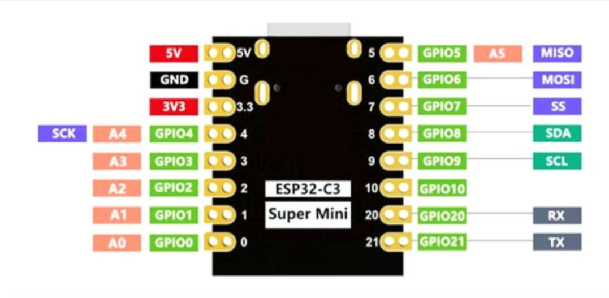
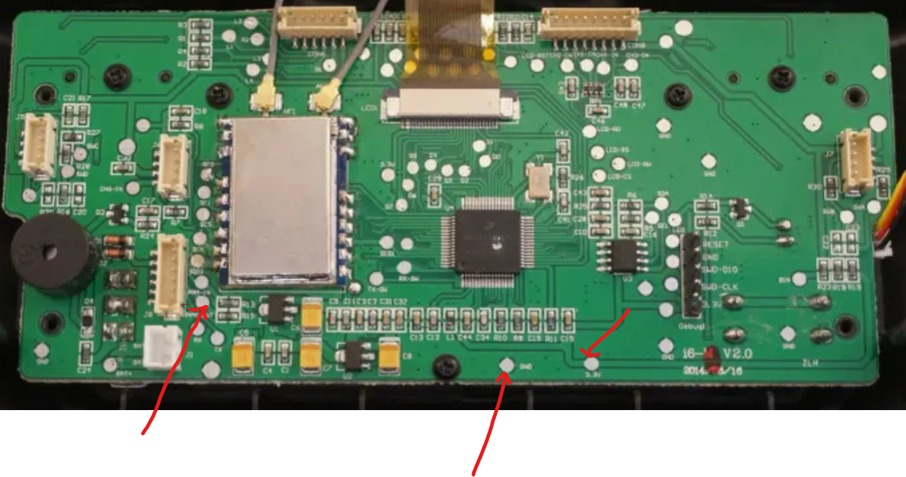

# FS-i6 BLE Gamepad Mod

Are you tired of proprietary cables and janky solutions like FTDI adapters and vJoy to connect your outdated FS-i6 to the simulator? You are not alone. The FS-i6 was the entry into the RC hobby for many, but slowly its lack of a Bluetooth joystick feature has made it harder for users to practice flying in simulators. 

So I decided to take matters into my own hands and create my first electronics project on GitHub and open-source it! I used AI to write the code for the ESP32-C3, so it might have some bugs, but it has worked well so far.

🎁Features :

✨ OTA firmware upload (useful for uploading future revisions without opening the radio up)
PS.... update the Wifi Credentials in the main.cpp

✨ Sleep mode with configurable timeouts (10sec for BLE and 5sec for WiFi)

## Components Required for the Mod
1. ESP32-C3 (Super Mini recommended)
2. Wires
3. Heat Shrink Tube (2-3cm diameter)

## Tools
1. Soldering Setup
2. Phillips Head screwdriver to disassemble the FS-i6 radio

> **NOTE:** It is highly recommended that the soldering is done by someone with prior experience.

## Steps

1. **Locate the Pads:** Locate the PPM OUT, 3.3V, and GND pads on the radio PCB and solder the wires according to the schematic. (Refer to the images below).
   * **PPM OUT** -> **GPIO4**
   * **3.3V** -> **3V3**
   * **GND** -> **GND**

   *(Save the images you shared into your repository folder and update these links if you name them differently!)*
   
   
   

2. **Insulate:** Shrink wrap the ESP32-C3 after programming it and ensure that all the wires emerge out neatly from one side to prevent any accidental shorts.

3. **Reassemble:** Twist the cables together to avoid a mess. Secure the ESP32-C3 inside empty space within the radio body and screw on the back cover.

 

🚨 DISCLAIMER: The RC hobby can get dangerous if radio control equipment is damaged and fails mid-flight. Modifying your transmitter's internal hardware carries inherent risks. Please proceed at your own risk, double-check all your solder joints, and ensure you properly thoroughly test the radio on the ground and in simulators before risking a real model in the air!

 

## Contributions
It would be amazing if people send suggestions, bug fixes, and code optimizations! Feel free to open issues or submit Pull Requests.